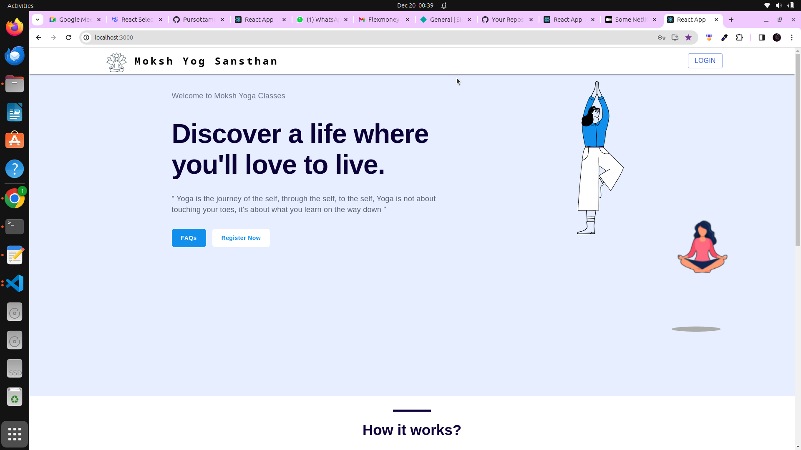
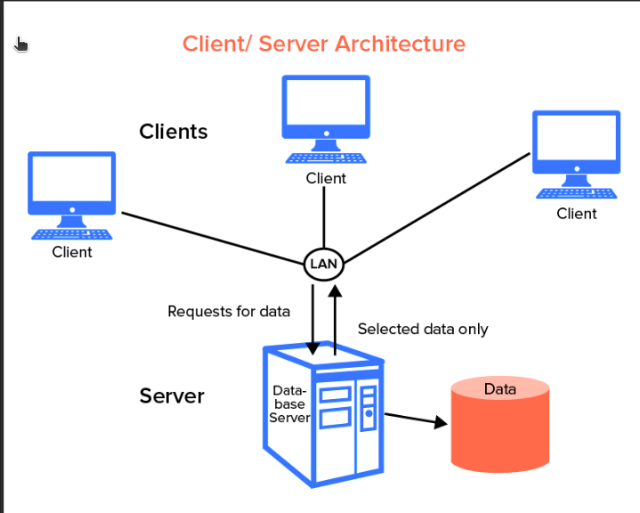
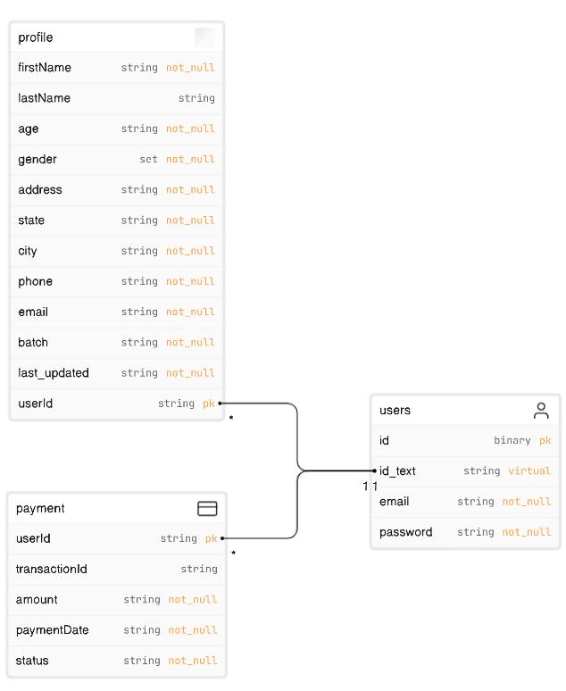
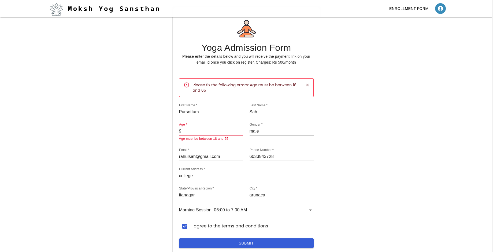
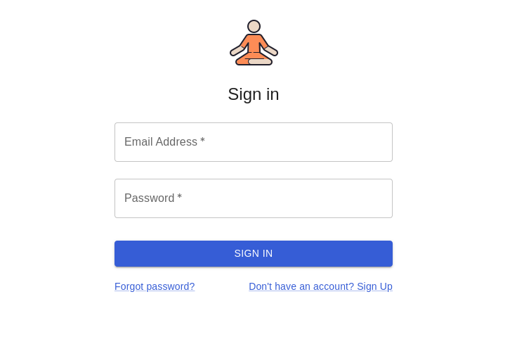
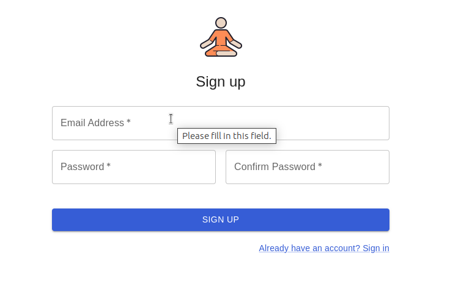
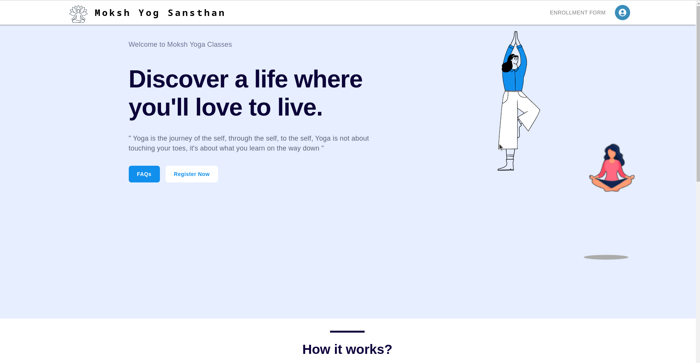
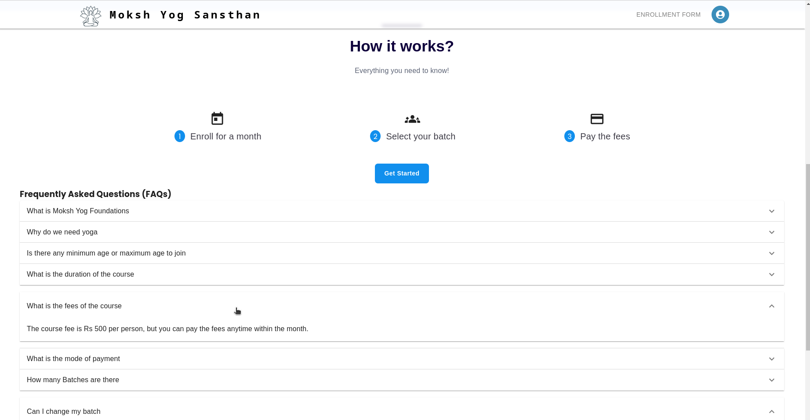
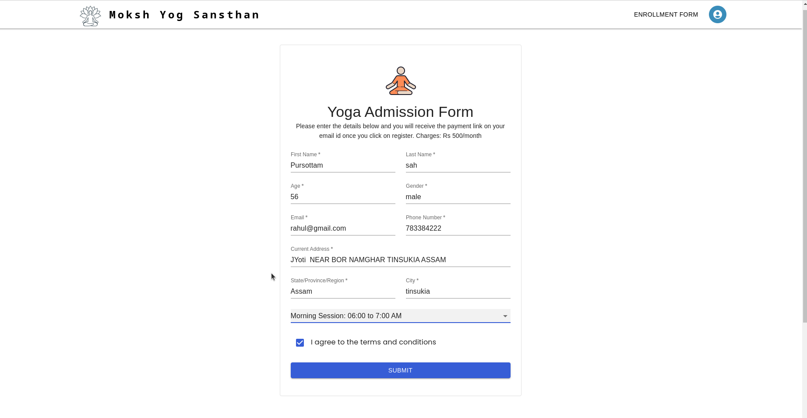
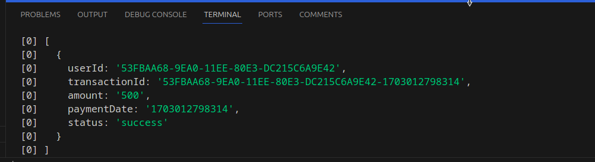

# Flexmoney SDE Internship Assignment 
> This repo contains code for internship task @flexmoney 2023 Assignment



## Problem Statement 
Assume that you are the CTO of an outsourcing firm which has been chosen to build an
admission form for the Yoga Classes which happen every month.
Requirements for the admission form are:
- Only people within the age limit of 18-65 can enroll for the monthly classes and they will
be paying the fees on a month on month basis. I.e. an individual will have to pay the fees
every month and he can pay it any time of the month.
- They can enroll any day but they will have to pay for the entire month. The monthly fee is
500/- Rs INR.
- There are a total of 4 batches a day namely 6-7AM, 7-8AM, 8-9AM and 5-6PM. The
participants can choose any batch in a month and can move to any other batch next
month. I.e. participants can shift from one batch to another in different months but in the
same month they need to be in the same batch.


### Links
Frontend hosted at: https://pursottam-yoga-app.netlify.app/

Note: API Integration with frontend is completed but i am unable to host on servers

Backend hosted at: https://onrender.com 
## Solution Approach
1. The initial step involves creating a form with an aesthetically pleasing UI for uploading user details.

2. For the backend, it is crucial to design an architecture to store user details. The focus is on defining the structure and components of the backend architecture.

3. To establish a seamless connection between the frontend and backend, an Entity-Relationship diagram needs to be created. This diagram aids in comprehending the relationships between entities and serves as a guide for developing APIs to facilitate communication between the frontend and backend.

## Demo Video 
<!-- 
<iframe width="560" height="315" src="https://www.youtube.com/embed/VL1CYSIhGP8?si=5ZSts_-oZb5Zp1VX" title="YouTube video player" frameborder="0" allow="accelerometer; autoplay; clipboard-write; encrypted-media; gyroscope; picture-in-picture; web-share" allowfullscreen></iframe> -->

https://youtu.be/VL1CYSIhGP8?si=kMNYL7MBOkcsC-47

### Technologies Used
* ReactJS
* NodeJS
* ExpressJS
* Mysql 
* Material UI

### Installation
* Clone the repository

```bash
git clone "https://github.com/Pursottam6003/Flexmoney-app"

```
* Install the dependencies

```bash
npm install
```

* Run the frontend server and backend server

```bash
npm start
```
* Open the browser and go to http://localhost:3000 
Server is listening on PORT 5000 ie  http://localhost:5000 

## Archietecture 

### Structure
Structure is basically a 2 tier achiectecture 
- Client : contains frontend code made using React.js and Material Ui 
- Server : contains backend APIs made using Node.js and Mysql database 

### Entity Relationship Diagram
Database Name : <kbd>yogaDatabase</kdb>

Here we have three tables in our server 
<kbd>users</kbd>  <kbd>profile</kbd>     <kbd>payments</kbd>
Here they are explained using the diagram 




## Screenshorts 

To check the form validation here i have done the following checks 
* Form validations



* Login and Sign Up form 




* After Login 


* Frequently asked questions 


* Enrollment Form 


* Updation Form to update from one batch to another 

* Payment Form 


* Payment Reciept 

## Author

- [@Pursottam6003](https://www.github.com/Pursottam6003)
- https://www.linkedin.com/in/pursottamsah/
- https://pursottam.github.io/


